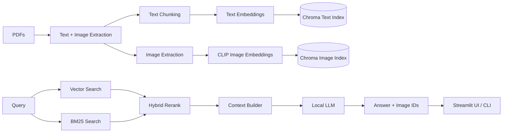

# Local Multimodal RAG (Text + Image)

Production-style, local-first multimodal RAG pipeline for PDFs. It ingests documents, extracts images, builds
vector indexes, and answers queries using local models. Includes a Streamlit UI and a CLI.

## Highlights
- Local embeddings for text (MiniLM) and images (CLIP).
- Hybrid retrieval: vector search + BM25 for better factual recall.
- Local LLM generation (no external API required).
- Disk-based cache for retrieval and answers.
- Streamlit UI for browsing and querying.

## Architecture



## Theory Notes

### Multimodal RAG Basics
Retrieval-Augmented Generation (RAG) splits the problem into retrieval and generation. For multimodal PDFs:
- Text is chunked and embedded into a text vector space.
- Images are embedded into a visual space (CLIP) that is aligned with text queries.
- The retriever supplies evidence (chunks + images), and the generator uses that evidence to answer.

### Why Hybrid Retrieval (Vector + BM25)
Vector search captures semantic similarity, but it can miss exact terms, entities, or numeric phrases.
BM25 is strong at exact term matching and factual lookups. Combining them improves recall:
- Vector search retrieves semantically related content.
- BM25 boosts exact term hits (e.g., formulas, names, section titles).
- Weighted fusion gives a stable ranking across both signals.

### CLIP Cross-Modal Alignment
CLIP embeds images and text into a shared vector space. A text query can retrieve images by proximity
in that shared space, enabling text-to-image retrieval without captions or OCR.

### Chunking Trade-offs
Smaller chunks increase retrieval precision but can lose context; larger chunks preserve context but
reduce specificity. The default chunk size aims to balance both for technical PDFs.

### Caching and Determinism
Caching is based on a hash of the query, models, and retrieval/generation parameters. This makes
results reproducible and avoids recomputation for identical inputs.

## Repository Layout
- `mmrag_config.py` configuration for models, retrieval, and caching.
- `mmrag_utils.py` PDF parsing, chunking, and image extraction.
- `mmrag_models.py` local model loading for embeddings + LLM.
- `mmrag_index.py` ingestion and Chroma indexing.
- `mmrag_query.py` retrieval + hybrid BM25 + answer generation.
- `mmrag_cache.py` on-disk cache for retrieve/answer calls.
- `mmrag_cli.py` CLI entry point.
- `streamlit_app.py` Streamlit UI.
- `data/` input data and extracted images (local runtime data).
- `index/` Chroma persistent indexes.
- `cache/` retrieve/answer cache entries.
- `output/` logs and run artifacts.


## Requirements
- Python 3.10+ recommended
- Local models cached in Hugging Face:
  - `sentence-transformers/all-MiniLM-L6-v2`
  - `openai/clip-vit-base-patch32`
  - One local LLM (default: `Qwen/Qwen2.5-1.5B-Instruct`)

## Installation

```powershell
# Activate venv
.\.venv\Scripts\Activate.ps1

# Core deps
python -m pip install chromadb sentence-transformers transformers pillow pymupdf

# BM25 hybrid retrieval
python -m pip install rank_bm25

# Streamlit UI
python -m pip install streamlit
```

## Data Ingestion

Place PDFs in:
- `data/input/pdfs`

Then run:

```powershell
python mmrag_cli.py --reset
python mmrag_cli.py --ingest data\input\pdfs\your_doc.pdf
```

You can pass multiple PDFs:

```powershell
python mmrag_cli.py --ingest data\input\pdfs\doc1.pdf data\input\pdfs\doc2.pdf
```

## Query via CLI

```powershell
python mmrag_cli.py --query "Explain the key ideas of attention in neural networks."
```

Disable caching:

```powershell
python mmrag_cli.py --query "..." --no-cache
```

Disable BM25:

```powershell
python mmrag_cli.py --query "..." --no-bm25
```

## Streamlit UI

```powershell
streamlit run .\streamlit_app.py
```

Features:
- Upload PDFs and ingest.
- Toggle caching and BM25 hybrid retrieval.
- Query and view retrieved images and text.

## Caching

Caching is on-disk and content-addressed by a hash of input payloads.
Two namespaces are used:
- `cache/retrieve/*.json` for retrieval results
- `cache/answer/*.json` for generated answers

This avoids repeated embedding and LLM work for identical requests.

## Configuration

Edit `mmrag_config.py` to change:
- Model IDs (text embedding, CLIP, LLM)
- Chunk sizes and retrieval top-k
- BM25 toggles and hybrid weights
- Cache path and enable/disable

## Output Artifacts

Logs and intermediate results are written to `output/`, for example:
- `output/ingest.log`
- `output/context.json`
- `output/answer.json`
- `output/query.log`

## Reproducibility

To reproduce results on a fresh machine:

1) Create and activate a venv
```powershell
python -m venv .venv
.\.venv\Scripts\Activate.ps1
```

2) Install dependencies
```powershell
python -m pip install chromadb sentence-transformers transformers pillow pymupdf rank_bm25 streamlit
```

3) Ensure local models are cached
- Text embedder: `sentence-transformers/all-MiniLM-L6-v2`
- CLIP: `openai/clip-vit-base-patch32`
- LLM: `Qwen/Qwen2.5-1.5B-Instruct` (or override in `mmrag_config.py`)

4) Add PDFs to ingest
- Place files in `data/input/pdfs`

5) Rebuild the index and run a query
```powershell
python mmrag_cli.py --reset
python mmrag_cli.py --ingest data\input\pdfs\your_doc.pdf
python mmrag_cli.py --query "Explain the key ideas of attention in neural networks."
```

6) (Optional) Run the UI
```powershell
streamlit run .\streamlit_app.py
```

Notes:
- Reproducibility depends on the exact model versions available in your local HF cache.
- For identical outputs, keep the same `mmrag_config.py` and cache settings.

## Limitations
- Image retrieval uses CLIP embeddings only (no OCR or captioning).
- Large PDFs can be slow on CPU.
- LLM output quality depends on your local model size.

## Roadmap Ideas
- Add OCR-based captions for images to improve retrieval.
- Add reranking with a cross-encoder.
- Add dataset/versioned index snapshots.
- Add telemetry and evaluation harness.

## License
MIT
